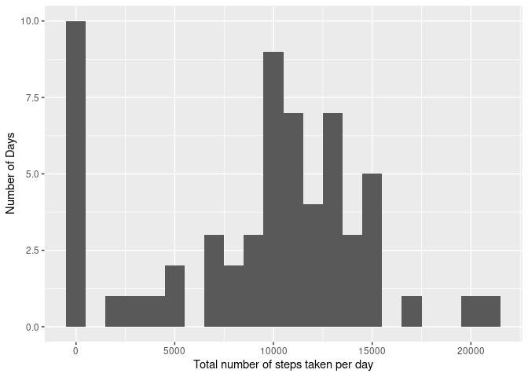
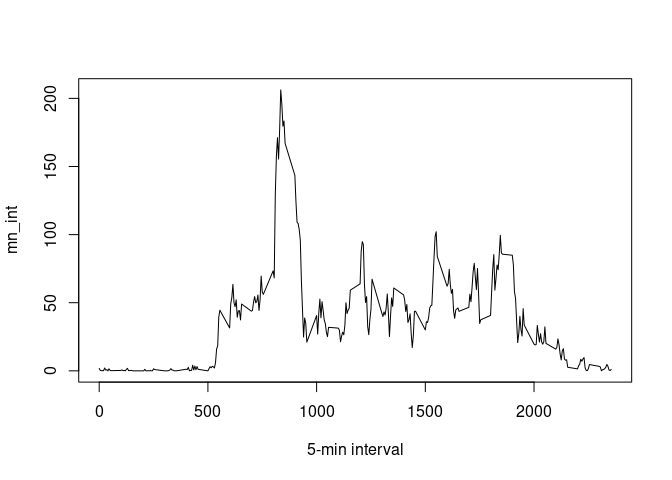
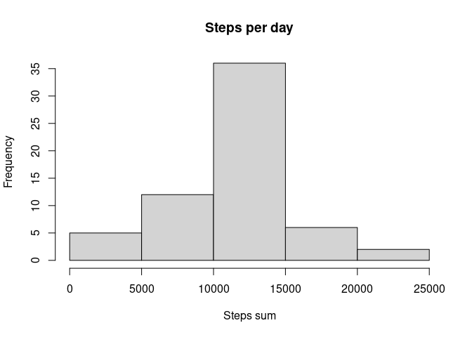
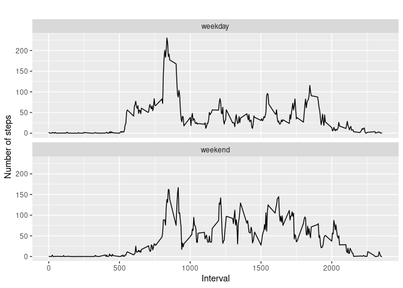

---
title: "Reproducible Research: Peer Assessment 1"
output: 
  html_document:
    keep_md: true
---


## Loading and preprocessing the data

```r
unzip(zipfile="activity.zip")
```

```
## Warning in unzip(zipfile = "activity.zip"): error 1 in extracting from zip file
```

```r
activity<-read.csv("activity.csv",header=T,sep=",")
```
## What is mean total number of steps taken per day?

```r
total.steps<-tapply(activity$steps,activity$date, sum, na.rm=TRUE)
library(ggplot2)
qplot(total.steps,binwidth=1000,xlab="Total number of steps taken per day",ylab = "Number of Days")
```

<!-- -->

```r
mean(total.steps, na.rm=TRUE)
```

```
## [1] 9354.23
```

```r
median(total.steps, na.rm=TRUE)
```

```
## [1] 10395
```

## What is the average daily activity pattern?

```r
mn_int <- tapply(activity$steps, activity$interval, mean, na.rm=TRUE)
plot(mn_int ~ unique(activity$interval), type="l", xlab = "5-min interval")
```

<!-- -->
5-minute interval, on average across all the days in the dataset, which contains the maximum number of steps

```r
mn_int[which.max(mn_int)]
```

```
##      835 
## 206.1698
```


## Imputing missing values

```r
miss <- is.na(activity$steps)
# How many miss
table(miss)
```

```
## miss
## FALSE  TRUE 
## 15264  2304
```
Strategy for filling in all of the missing values in the dataset: replace any NA with the mean of the corresponding interval

New dataset that is equal to the original dataset but with the missing data filled in

```r
activity3 <- activity
for (i in 1:nrow(activity)){
    if(is.na(activity$steps[i])){
        activity3$steps[i]<- mn_int[[as.character(activity[i, "interval"])]]
    }
}
```

Histogram of the total number of steps taken each day

```r
summary <- tapply(activity3$steps, activity3$date, sum, na.rm=TRUE)
hist(summary, xlab = "Steps sum", main = "Steps per day")
```

<!-- -->
New mean and median total number of steps taken per day

```r
mean(summary, na.rm=TRUE)
```

```
## [1] 10766.19
```

```r
median(summary, na.rm=TRUE)
```

```
## [1] 10766.19
```
Mean and median value almost the same after we filled in the missing value with the mean steps for that 5-minute interval. 

## Are there differences in activity patterns between weekdays and weekends?

```r
activity3["type_of_day"] <- weekdays(as.Date(activity3$date))
activity3$type_of_day[activity3$type_of_day  %in% c('Saturday','Sunday') ] <- "weekend"
activity3$type_of_day[activity3$type_of_day != "weekend"] <- "weekday"
```

Below is the panel plot:

```r
# convert type_of_day from character to factor
activity3$type_of_day<-as.factor(activity3$type_of_day)
# calculate average steps by interval across all days
activity3_steps_by_interval <- aggregate(steps ~ interval + type_of_day, activity3, mean)
qplot(interval, 
      steps, 
      data = activity3_steps_by_interval, 
      type = "l", 
      geom=c("line"),
      xlab = "Interval", 
      ylab = "Number of steps", 
      main = "") +
  facet_wrap(~ type_of_day, ncol = 1)
```

```
## Warning: Ignoring unknown parameters: type
```

<!-- -->
